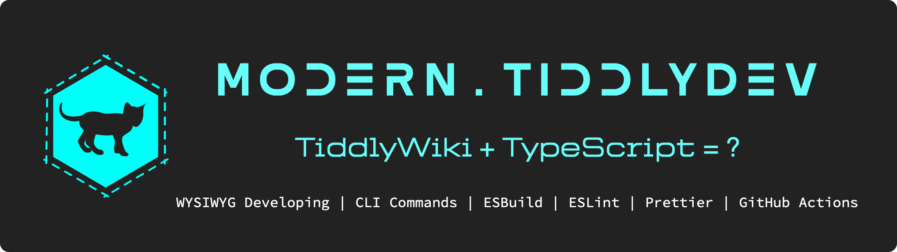

# Modern.TiddlyDev

&nbsp;&nbsp;&nbsp;&nbsp;&nbsp;&nbsp;&nbsp;&nbsp;

&nbsp;&nbsp;

[View Tutorials](https://tiddly-gittly.github.io/Modern.TiddlyDev/)

Modern.TiddlyDev is a one-click development environment for various TiddlyWiki plug-in developers built on a modern front-end technology stack, with the following features and functions:

* Compile, test and publish plug-ins with one click:
  * Open the page server in development mode, which can be tested in the browser, automatically detect changes to the plug-in files and synchronize the plug-in content updates to the browser page, realizing the WYSIWYG of plug-in development;
  * One-click plugin building and support for generating plugin library for use by your subscribers.
  * Has a built-in GitHub Page publishing script that automatically publishes written plugin documentation pages and plugin library to the Internet;
  * Built-in GitHub Release script, which releases the plugin according to the version specified by the git tag;
* Tailored for TypeScript plugin development, so it is now easy to use TypeScript development in TiddlyWiki:
  * Multi-entry file compilation is supported, and various plugins can be easily written in TiddlyWiki;
  * Support for `.ts`, `.tsx`, `.jsx`, `.mjs`, `.cjs` files compiled with the [tw-react](https://github.com/tiddly-gittly/tw-react) plugin for React development in TiddlyWiki;
  * Use [tw5-typed](https://github.com/tiddly-gittly/TW5-Typed) to type annotate TiddlyWiki API to bring a native TypeScript experience to development;
  * Use the full amount of ESLint and Prettier rules provided by [Modern.JS](https://modernjs.dev/) to normalize the code;
  * Incremental project builds using the extremely fast [esbuild](https://esbuild.github.io/), which makes writing code a blast;
  * Support for setting browser compatibility ranges for plugins using [browserslist](https://browsersl.ist/);
  * Automatically generate sourcemap for source code (start by default when developing, specify to turn on when building), no need to worry about debugging!
  * The possibility of introducing CSS, JSON, etc. into the script;
  * Automatic volume compression of the plug-in (can be turned off);
  * Automatic generation of hash-check signatures for the generated plug-ins;

Don't worry, even if you are not good at programming, it doesn't matter, Modern.TiddlyDev can be your development tool as well. No code plugin development can be an enjoyable development experience as well!

There's a lot of work here, but it's just Out-of-the-Box for you. Use it and get started on your modern TiddlyWiki plugin development journey!

